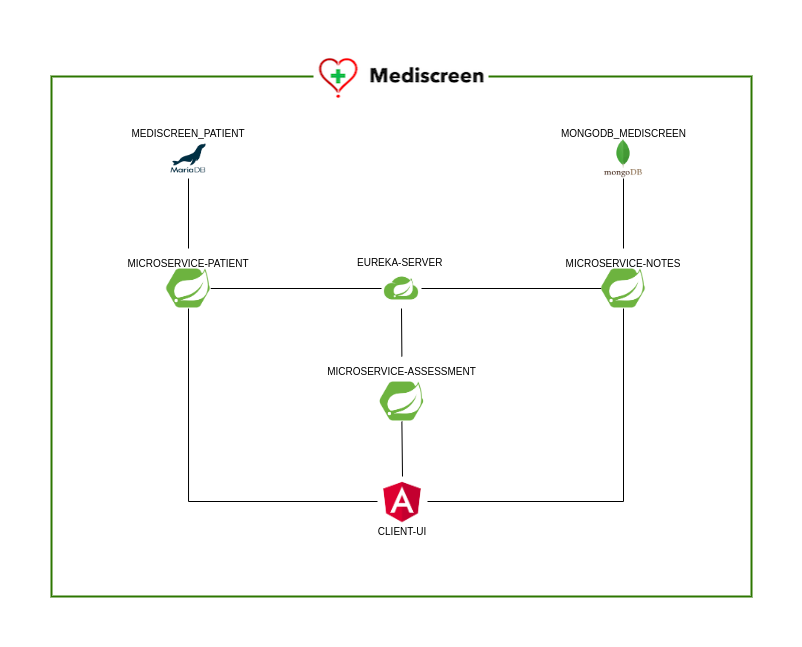

# Mediscreen

Mediscreen is an application for managing patients and assessing their risk of diabetes using their history notes.

## Architecture

Mediscreen is a microservice application based on spring cloud.



The entry point is Client-ui, an Angular website that interfaces with several REST APIs:

- microservice-patient
- microservice-notes
- microservice-assessment

All microservices are developed with Java.
They are connected each other thanks to __eureka-server__

### Microservice Patient

With this microservice, you can manage your patient information.

Microservice Patient use a __MariaDB__ Database to record persistent data.

You can read [dedicated documentation](microservice-patient/README.md) for technical details.

### Microservice Notes

With this microservice, you can manage your patient history notes.

Microservice Notes use a __MongoDB__ data base to record persistent data.

You can read [dedicated documentation](microservice-notes/README.md) for technical details.

### Microservice Assessment

With this microservice, you can assess your patient diabetes risk.

He used patient information and patient history notes to calculate this risk thanks to __OpenFeign__.

You can read [dedicated documentation](microservice-assessment/README.md) for technical details.

### Eureka Server

This server is using to connect all Java microservices.

It simplifies requests made with __OpenFeign__ to the other Java microservice APIs.

You can read [dedicated documentation](eureka-server/README.md) for technical details.

### Client UI

Is a user interface to simplify interact with all microservices.

You have access all information about your patients, update it or create new. You can also take note and update it for each.

The interface show the risk have been assessed with your notes for each patient.

You can read [dedicated documentation](client-ui/README.md) for technical details.

## How to use

You have 2 ways to use Mediscreen. 

You can deploy each database, server, UI and microservice on dedicated server or simply use docker-compose file present in root project folder.

The docker-compose build image from each component thanks to dockerfile present in all subprojects by the following command:

```shell
docker-compose up -d --build 
```

> __/!\ Before starting docker-compose, you must compile each component with Maven or Node.__  

When all services are started, you can connect to `http://localhost` with your web browser.
